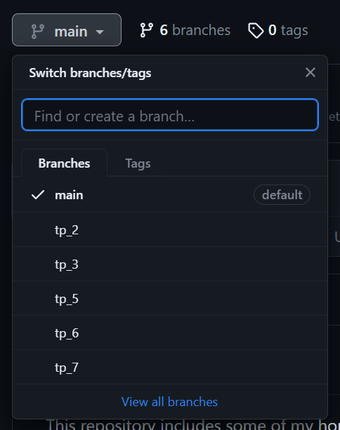

# java-oop
This repository includes some of my homework solutions created in the Object Oriented Programming (OOP) course using Java.

## Spotted any errors ?
If you have noticed any errors, please feel free to correct them and create a pull request. Your contribution would be greatly appreciated.

## Getting started
1. change branches to find the tps

2. you will find the solutions and questions on that wpecific branch

